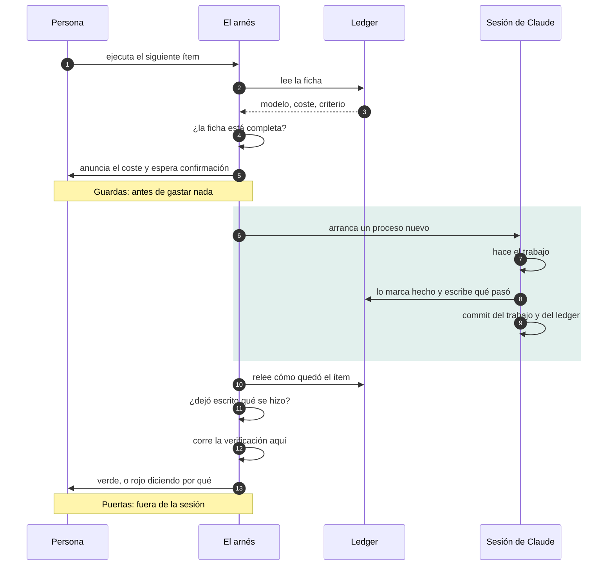
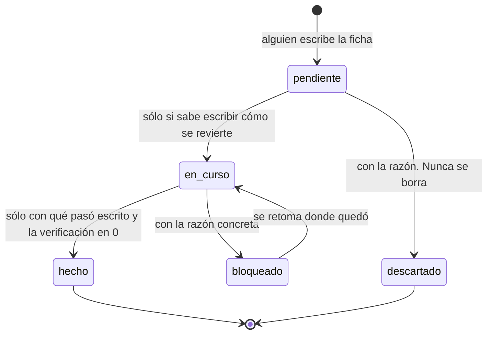

# Arnés de ejecución de planes de ingeniería

Una forma de trabajar con un asistente de código en tareas largas sin que se pierda el hilo,
sin que se dispare el coste y sin que nadie tenga que acordarse de en qué iba.

Es un plugin de Claude Code. No depende del lenguaje ni del stack de tu proyecto: lo único que
deja en tu repositorio es el ledger, un JSON con tu plan. La herramienta se actualiza con
`claude plugin update`; tu plan no se toca.

**Sistemas.** Los scripts son bash y Python 3, así que corren en macOS, Linux y en Windows sobre
git-bash o WSL —que es lo que Claude Code usa allí—. El intérprete se resuelve solo (`python3` o
`python`, según el sistema), y en Windows el lanzador se instala además como `arnes.cmd` para que
PowerShell y `cmd` sepan invocarlo — envoltorio que localiza él mismo el `bash` de Git for Windows,
porque ese intérprete no está en el PATH de Windows. Allí `~/.local/bin` no está en el PATH y ponerla exige editar
el registro, así que lo hace el propio arranque, en el ámbito del usuario y sólo si falta. El
recorrido completo **no** está probado en Windows; los informes de fallo son bienvenidos.

---

## El problema que resuelve

Cuando le pides a un asistente que ejecute un plan de varias semanas, pasan cuatro cosas:

1. **Se pierde el avance.** La sesión se corta —límite de uso, un `/clear`, cerrar la terminal— y
   con ella se va el "por dónde íbamos". Lo que quedó a medias no está en ningún sitio.
2. **El coste se descontrola.** Todo se hace con el modelo más caro porque nadie decidió por
   adelantado cuál merecía cada tarea, y el contexto de la sesión crece arrastrando lo anterior.
3. **El alcance se desborda.** Empieza arreglando una cosa, encuentra otra, y tres horas después
   hay un diff de 40 archivos que nadie puede revisar.
4. **"Ya está" no significa nada.** Sin un criterio escrito ANTES, el criterio se escribe después,
   viendo el resultado — que es la forma estándar de conseguir el número que uno quería.

El arnés ataca las cuatro con la misma idea: **el plan vive en un archivo del repositorio, no en la
memoria de una conversación**, y se ejecuta un ítem por sesión.

---

## Cómo funciona

Dos diagramas describen el mecanismo completo. GitHub los renderiza aquí mismo; la misma fuente
alimenta la página de presentación (`docs/index.html`), y `tests/prueba.sh` falla si las dos copias dejan de
coincidir.

La documentación completa —comandos, modos, guardas, mensajes y campos del ledger— está publicada
en **<https://danielwueno.github.io/arnes-plan/>**, y `arnes docs` la abre en la versión que tengas
instalada.

**Una invocación, de principio a fin.** Lo único que hay que mirar es la caja: dentro está lo que
el agente dice de su propio trabajo, y fuera está lo que decide si el ítem cuenta como cerrado.



**El ciclo de vida de un ítem.** Las condiciones están escritas en las flechas porque el arnés las
comprueba él: no son buenas intenciones. Y ningún camino borra nada.



---

## Las piezas

| Pieza | Qué hace |
|---|---|
| `docs/plan/ejecucion-plan.estado.json` | **El ledger.** La fuente de verdad del avance. Sobrevive al reinicio del límite, a `/clear` y a cerrar la terminal. Todo lo demás lo lee. |
| `/arnes-plan:plan-siguiente` | Ejecuta **un** ítem, lo verifica con su propio criterio, actualiza el ledger, commitea y **se detiene**. Acepta un id o `ola:N`. |
| `/arnes-plan:plan-estado` | El avance sin ejecutar nada. Corre en el modelo barato; cuesta casi nada. |
| `scripts/plan-run.sh` | Lanza un ítem en una **sesión nueva** de Claude Code: contexto limpio de verdad, no un `/clear`. Anuncia el ítem antes y frena si algo no cuadra. |
| Hook `SessionStart` | Cada sesión arranca sabiendo qué ítem toca. Lo resuelve un script, así que averiguarlo cuesta cero tokens. |
| `scripts/validar-ledger.py` | Comprueba que el ledger está bien formado, y que las aristas de `bloqueado_por` son honrables por el orden del documento. Un campo mal escrito no rompe nada visiblemente: sólo hace que la próxima invocación elija mal. Con `--item ID` juzga una sola ficha, que es como lo llama `plan-run.sh` antes de gastar. |

Los comandos van **cualificados con el nombre del plugin**. La forma corta
—`/plan-siguiente`— responde `Unknown command`: los slash commands de un plugin viven en su propio
espacio de nombres. Escribiendo `/plan` el autocompletado ofrece la forma correcta.

---

## Instalar

```bash
claude plugin marketplace add DanielWueno/arnes-plan
claude plugin install arnes-plan@arnes-plan
```

Reinicia la sesión para que carguen el hook y los dos comandos. A partir de ahí, en cualquier
proyecto:

```bash
/arnes-plan:plan-estado        # el avance, sin ejecutar nada
/arnes-plan:plan-siguiente     # ejecuta UN ítem y se detiene
```

Dentro de una sesión de Claude Code no hace falta nada más: esos dos comandos ya saben dónde está
el plugin. Lo de abajo es para la terminal, y existe porque un slash command no puede darte lo que
más valor tiene aquí — que cada ítem arranque en un proceso nuevo, sin heredar el contexto de lo
anterior.

### Dejar el proyecto listo

Recién instalado el plugin, dentro de Claude Code:

```
/arnes-plan:plan-arrancar
```

Sin rutas y sin variables: dentro de una sesión el plugin ya sabe dónde está. Sirve tanto si eres
el primero que llega como si el plan ya existe, y además instala el lanzador `arnes` para la
terminal. Fuera de Claude Code hay una forma equivalente, que exige resolver a mano la ruta del plugin: está
en **Si prefieres no instalar nada en el PATH**, aquí debajo.

- **Repositorio sin plan:** siembra la plantilla y te dice qué escribir.
- **Repositorio que ya tiene plan** —el caso del segundo que clona— **no toca nada**, valida el
  ledger que hay y te anuncia el ítem que toca. Correrlo dos veces no hace daño.

**Nunca sobrescribe un ledger.** El script existe en lugar de un `cp` en las instrucciones porque
copiar la plantilla sobre `ejecucion-plan.estado.json` reemplaza el plan de quien llegó antes, sin
aviso y sobre el único fichero que registra el avance. La comprobación la hace la herramienta, no
una advertencia en la documentación.

### El comando `arnes`

`/arnes-plan:plan-arrancar` instala un lanzador en `~/.local/bin` —donde vive el propio `claude`, así que ya
está en tu PATH— y a partir de ahí el arnés es un comando normal:

```bash
arnes                    # el siguiente ítem, en sesión limpia
arnes --solo-anunciar    # qué toca, sin ejecutar ni gastar
arnes 5.0 --auto         # uno concreto, con menos prompts
arnes arrancar           # dejar listo otro proyecto
arnes --help             # todos los comandos, y dónde estás ahora
```

`arnes --help` no repite esta página: es la referencia de una pantalla —verbos, modos de
supervisión, slash commands, variables de entorno— y termina diciéndote **el proyecto, el ledger y
el ítem que toca**. Un README hay que ir a buscarlo; en una terminal nadie lo hace.

**No lleva ninguna ruta dentro.** Resuelve la instalación en cada ejecución, así que sigue
funcionando después de cada `claude plugin update` sin que haya que tocarlo ni recordar nada. Si lo
borras, `/arnes-plan:plan-arrancar` lo vuelve a crear; si ya tenías un `arnes` tuyo en el PATH, no lo pisa.

Y resuelve a la instalación **activa**, no a la versión más alta que haya en el cache: ahí quedan
las viejas y también versiones que nunca se activaron, y ejecutar en silencio una que no está en
uso es justo el fallo que este arnés existe para no cometer.

<details>
<summary>Si prefieres no instalar nada en el PATH</summary>

Las rutas largas siguen funcionando. `ARNES` es el directorio `scripts/` del plugin:

```bash
export ARNES="$(claude plugin list --json \
  | python3 -c 'import json,sys; print(next(p["installPath"] for p in json.load(sys.stdin) if p["id"].startswith("arnes-plan")))')/scripts"
```

Con la variable definida, cada verbo tiene su forma larga:

```bash
bash "$ARNES/arrancar.sh"                   # dejar el proyecto listo
bash "$ARNES/plan-run.sh" --solo-anunciar   # ¿qué toca? (no ejecuta nada)
bash "$ARNES/plan-run.sh"                   # ejecutar el siguiente, en sesión limpia
bash "$ARNES/plan-run.sh" 5.0               # ejecutar uno concreto
bash "$ARNES/plan-run.sh" ola:5             # el siguiente de una ola
python3 "$ARNES/validar-ledger.py"          # equivale a `arnes validar`
```

Dos detalles que suelen confundir: `claude plugin list` a secas **no** dice la ruta —sólo nombre,
versión y estado, hace falta `--json`— y para actualizar, el nombre tiene que ir cualificado:
`claude plugin update arnes-plan@arnes-plan`.
</details>

### Ejecutar

```bash
arnes --solo-anunciar   # ¿qué toca? (no ejecuta nada)
arnes                   # ejecutar el siguiente, en sesión limpia
arnes 5.0               # ejecutar uno concreto
arnes ola:5             # el siguiente de una ola
```

Las banderas van en cualquier orden y se combinan con el id.

### Ver el plan

```bash
arnes ver          # la vista web del plan, en el navegador
arnes ver --live   # además la sirve y la recarga al cambiar el ledger
```

Una página con el avance por ola, los criterios de entrada y salida de cada
una, y cada ítem con lo que se hizo, cómo se verificó y cómo se revierte. Sale
del ledger con Python: no gasta una llamada al modelo, a diferencia de
`/arnes-plan:plan-estado`, que es su equivalente en texto dentro de la sesión.

La página se escribe en un temporal y se abre sola. Para compartirla no hay que
ir a buscar el archivo: lleva **Guardar copia** —descarga la propia página en un
solo `.html` autocontenido, sin red ni dependencias, listo para adjuntar—,
**Copiar resumen** —el estado en texto, para pegarlo en un chat— e **Imprimir o
PDF**. Con `--salida` se escribe donde se quiera.

`--live` no exige haber corrido `arnes ver` antes: si la página no existe o el
ledger es más reciente, la genera. El archivo del disco se mantiene al día
mientras el servidor corre, así que lo que se comparte nunca es una foto vieja.

Los campos del ledger que el arnés no conoce salen igual, al pie de cada ficha:
es donde acaban los hallazgos que no estaban previstos, y perderlos por no
tener plantilla sería el peor fallo posible en un visor, porque no se nota.

### Qué versión corro, y está sana

```bash
arnes --version    # arnes 1.12.0 (12fc26a)  — una línea, y nada más
arnes doctor       # el cuadro completo: rutas, lanzador, esquema, cache
```

Son dos preguntas distintas y por eso son dos comandos. `--version` contesta
*qué código corro* en una sola línea, con el commit —dos 1.12.0 de ramas
distintas son código distinto— y sin rutas: se pega en un informe de fallo y se
puede meter en una tubería. Contesta aunque no haya ledger, aunque `claude` no
esté en el PATH y aunque no haya plugin registrado, porque es lo primero que se
teclea cuando algo va mal.

`arnes doctor` contesta *si la instalación es coherente*, que en un plugin no es
una sola versión sino cuatro que se quedan atrás por su cuenta:

| Puede discrepar | Por qué se entera nadie |
|---|---|
| La copia **registrada** y la que de verdad se **ejecuta** | Una ruta del cache copiada de una consola vieja sigue siendo ejecutable meses después. |
| El **lanzador** de `~/.local/bin` | `arrancar` lo escribe una vez; `claude plugin update` no lo reescribe nunca. Desde 1.12.0 lleva sello de versión. |
| El **esquema del ledger** del proyecto | Viaja en otro repositorio. Mientras el arnés vivía dentro del proyecto no podían desincronizarse; como plugin, sí. |
| La versión **descargada** y la instalada | El clon del marketplace se actualiza por su cuenta y puede ir por delante días. |

Sale **1** sólo si algo está roto —una copia que no es la instalada, un esquema
que este arnés no sabe leer, un requisito que falta—. La deriva informativa sale
0: un doctor que se pone rojo por lo normal deja de leerse.

Al final informa de las **copias viejas del cache**. El barrido de Claude Code
descarta plugins que ya no se usan, no versiones antiguas de uno en uso, así que
se acumula una por cada `plugin update` para siempre. El disco no es el problema
—son unos megas—; lo es que cada copia es un arnés entero y ejecutable con una
ruta plausible, y correr una vieja es el fallo del que el arnés avisa pero que no
puede impedir. `arnes doctor --limpiar` las quita: conserva la instalada, no toca
nada que no lleve el manifiesto del plugin, y no borra la copia desde la que se
está ejecutando. No pide confirmación porque el `doctor` a secas ya lista lo que
borraría — él es el ensayo en seco.

### Cuánta supervisión

| Modo | Qué cambia | Cuándo |
|---|---|---|
| *(por defecto)* | Sesión interactiva. Apruebas los permisos y las confirmaciones. | Casi siempre. Es el comportamiento predecible. |
| `--auto` | Interactiva, pero el clasificador de auto mode resuelve los permisos rutinarios. Lo destructivo sigue frenando y tú sigues delante para confirmar una corrida larga. | Ítems con mucha edición de archivos, donde aprobar uno por uno no aporta criterio. La primera vez, Claude Code pide aceptar el modo. |
| `--desatendido[=N]` | Sin sesión interactiva (`claude -p`) **y sin pedir permisos**, con techo de gasto en dólares (`N`, por defecto 5). | Los ítems mecánicos: `haiku`, cero horas de máquina. Revisas el commit al terminar, no durante. |

Que `--desatendido` no pida permisos no es comodidad, es lo que lo hace funcionar: el protocolo
empieza leyendo el ledger con un script, y en modo `-p` no hay nadie que apruebe esa llamada — con
permisos a medias la sesión abre y no hace nada. Es una escalada real, y es exactamente por eso que
este modo carga las guardas más duras del arnés y un techo de gasto obligatorio.

`--desatendido` **se niega** —y dice por qué— si el ítem pide más de una hora de máquina, lleva
`multiagente`, **el ledger lo marca `opus`**, está bloqueado, o el árbol tiene cambios sin
commitear. No es una restricción arbitraria: en modo `-p` no hay a quién preguntar, y el protocolo
exige preguntar justo en esos casos. Una pregunta que nadie puede responder no es una puerta, es un
cuelgue. `--igual` salta las guardas bajo tu responsabilidad.

La guarda de `opus` merece un párrafo propio, porque es la que más se nota. Ese campo es con el que
el ledger declara que en ese ítem el criterio *es* el trabajo, y dejarlo sin nadie delante es dejar
solo justamente lo que el arnés sostiene que no debe quedarse solo. Desde la 1.1.0 la regla vive en
el código; mientras vivió sólo en este README, su cumplimiento dependía de que alguien la recordara.

### Qué te puede frenar, de un vistazo

Todo esto lo dice la consola en el momento. La tabla está para lo otro: cuando el mensaje ya se
fue del scroll, o para decidir antes de lanzar si el ítem va a pasar.

| Antes de gastar | Interactivo y `--auto` | `--desatendido` |
|---|---|---|
| La ficha del ítem está incompleta: falta un campo obligatorio, o el `rollback` que se exige a lo que aún va a ejecutarse | **no lanza** | **no lanza** |
| El ítem arrastra un bloqueo **vigente**: `bloqueado_por` apunta a un ítem que no está `hecho` | pregunta | **se niega** |
| Pide **más de una hora** de máquina | pregunta | **se niega** |
| El árbol tiene cambios sin commitear — lo modificado y lo preparado; **un fichero nuevo sin `git add` no la dispara**, aunque un `git add -A` de cierre sí se lo lleve | pregunta | **se niega** |
| El ítem lleva `multiagente` | sigue | **se niega** |
| El ledger lo marca `opus` | sigue | **se niega** |
| El resto del ledger tiene problemas que no afectan a este ítem | avisa y sigue | avisa y sigue |

`--igual` salta la ficha incompleta y la negativa de `--desatendido`, además de las puertas de
cierre. **Las preguntas del modo interactivo no las salta:** si hay alguien delante, se contestan.
Responder que no cancela sin gastar, y el proceso sale con código **0**, no con error. Cuando
`--desatendido` se niega, enumera *todos* los motivos, no sólo el primero.

**`--auto` actúa sobre los permisos, no sobre las guardas.** Es la confusión más frecuente: un ítem
lanzado con `--auto` se detiene igual a preguntar si arrastra un bloqueo, si pide más de una hora o
si el árbol tiene cambios sin commitear. Las tres puertas siguen activas en los dos modos
interactivos. El único que no pregunta nunca es `--desatendido`, y por eso es el único que
*se niega* en vez de preguntar.

### El mensaje que estás viendo

| Dice | Qué pasó, y qué hacer |
|---|---|
| `No lanzo <id>: la ficha está incompleta` | Falta un campo obligatorio; el validador dice cuál justo encima. Complétalo, o `--igual`. |
| `No lanzo <id> desatendido` | Una o más guardas. Debajo van todos los motivos. Córrelo sin `--desatendido`, o con `--igual`. |
| `Está bloqueado. ¿Ejecutar de todas formas?` | El ítem declara un `bloqueado_por` cuyo destino sigue abierto. Responder que no cancela sin gastar nada. |
| `esperaba a <id>, que ya está hecho: no bloquea` | El ítem declara `bloqueado_por`, pero el bloqueante cerró. No frena, y se dice en voz alta porque el campo sigue en la ficha: si no, parecería que el arnés se comió un aviso. |
| `El árbol tiene cambios sin commitear` | El ítem cierra con commit y se los llevaría. Commitea o guarda lo tuyo antes. |
| `No encuentro el ledger.` | No hay ledger donde se busca. `arnes arrancar` lo siembra sin pisar nada. Con `PLAN_LEDGER`, revisa la ruta: **no cae de vuelta a la búsqueda normal**, así que una errata da este mismo mensaje aun teniendo un ledger válido en su sitio. |
| `Esta NO es la copia instalada del arnés` | Estás corriendo una ruta con la versión dentro. Usa `arnes`, que resuelve la instalación cada vez. |
| `No hay ítem que encaje con: -V` | Un arnés anterior a 1.12.0, donde `-V` se tomaba por un id. Actualiza: `claude plugin update arnes-plan@arnes-plan`. |
| `El cierre no dejó rastro` | El ítem quedó `hecho` sin `resultado`. Escríbelo, o reábrelo poniéndolo `en_curso`. |
| `La verificación falla, pero el ítem quedó hecho` | Su criterio no pasa fuera de su sesión. Nada se ha revertido. |
| `La verificación no terminó en N s` | Se cortó por tiempo. Sube `ARNES_LIMITE_VERIFICACION` si el comando es legítimamente lento. |
| `'claude' no está en el PATH` | El lanzador necesita el CLI de Claude Code para abrir la sesión. |

Códigos de salida: **1** si la ficha estaba incompleta, si `--desatendido` se negó o si el cierre
no se sostiene. **0** si el ítem corrió y cerró limpio, y también si se contesta que no a una de las
preguntas del modo interactivo: eso cancela sin gastar y no es un error. En los demás casos, el
código que devuelva la sesión.

El aviso de **claves fuera de esquema** no aparece al lanzar: `arnes` sólo muestra la salida del
validador cuando éste falla, y ese aviso lo emite una corrida que pasa. Para verlo, `arnes validar`.

Qué ítem toma `arnes`: el **primero en orden de fichero** cuyo estado sea `pendiente` o `en_curso`.
Un ítem a medias no se adelanta por estarlo — si quedó abierto más abajo, se lanza por su id. La
línea que aparece al abrir una sesión sí antepone los `en_curso`, de modo que ambas pueden
discrepar; `arnes ver` muestra la del lanzador y señala aparte los que quedaron abiertos.

Todo esto, y los campos que valida el ledger, está también en la página del arnés: `arnes docs` la
abre en la versión instalada. `arnes validar` —entero, `--item 5.0` o `--al-cerrar 5.0`— responde
si una ficha va a pasar **antes** de gastar nada; `arnes --solo-anunciar` muestra la ficha y el
coste, pero termina antes de validarla.

### La ficha tiene que estar completa antes de gastar

Antes de cualquier puerta de gasto y antes de arrancar la sesión, `plan-run.sh` valida **la ficha
del ítem que va a ejecutar**. Si le falta un campo obligatorio, no lanza nada: exit 1 y el
validador dice cuál. Esto ocurre en *todos* los modos, no sólo en `--desatendido`.

`rollback` es obligatorio en los ítems `pendiente` y `en_curso`, y no en los ya cerrados. Es la
regla que la plantilla ya enunciaba —*si no sabes escribir cómo se revierte, el ítem no está listo
para ejecutarse*— y no se puede aplicar hacia atrás: los ítems cerrados antes de que el campo
existiera no se van a volver a tocar, y reclamárselo sería ruido permanente. Un `"rollback": ""`
cuenta como ausente: un campo en blanco no es un plan de reversión.

Los slash commands ya validaban el ledger, pero **al cerrar**. Eso descubre el campo que falta
después de haber pagado la sesión; esta guarda lo descubre antes. `--igual` la salta, como las
demás.

Regla práctica: **si el ledger dice `haiku` y 0 horas, `--desatendido` es seguro; si dice `opus`,
quédate delante.** El campo `modelo` ya codifica cuánto criterio hace falta, y desde la 1.1.0 el
arnés la aplica él en vez de confiar en que te acuerdes.

### Y tiene que demostrarlo antes de darse por cerrado

Un ítem vuelve marcado `hecho` porque **lo marcó el mismo agente que lo hizo**. Por sí solo eso es
autoevaluación, y es el punto por donde se cuela un `hecho` optimista. Al salir la sesión —en todos
los modos— `plan-run.sh` comprueba dos cosas que no dependen de su palabra:

| Puerta | Qué exige | Por qué no basta con lo de antes |
|---|---|---|
| **Rastro** | El ítem cerrado trae `resultado`: qué se hizo y qué evidencia lo prueba. | Es el único rastro del cierre que otro puede leer y comprobar. Un `hecho` sin `resultado` es un `hecho` optimista con otro nombre. |
| **Criterio mecánico** | Si la ficha trae `verificacion_comando`, se corre **aquí**, y tiene que salir 0. | Corrido fuera de la sesión que declaró el ítem hecho, es la diferencia entre *"el agente dice que pasa"* y *pasa*. |

El comando corre en la raíz del proyecto con un límite de tiempo, para que uno colgado no deje una
sesión desatendida esperando indefinidamente. **El límite difiere según la vía:** por
`plan-run.sh`, `ARNES_LIMITE_VERIFICACION` con 900 s por defecto; por el hook, la misma variable
con **120 s** por defecto y un techo de **180 s** que impone Claude Code y que subir la variable no
levanta.

**Corren por las dos vías, con alcances distintos.** `plan-run.sh` las evalúa al salir la sesión.
El hook va asociado a la **escritura del ledger** y no a un comando, así que también cubre el
cierre hecho desde dentro con `/arnes-plan:plan-siguiente`, y el motivo llega en el momento en que
se produce y no varios pasos después. Tiene dos límites que conviene conocer: sólo dispara cuando
quien escribe es **Claude Code** —sus herramientas de edición— y sólo si el fichero se llama
exactamente `ejecucion-plan.estado.json`. Una edición a mano en otro editor no lo dispara, y un
ledger apuntado con `PLAN_LEDGER` con otro nombre se queda sin esa puerta. El hook además **nunca
falla**: escribe el motivo para que el modelo lo lea, y el código de salida distinto de 0 es cosa
sólo de `plan-run.sh`. Sólo se evalúan los ítems que **acaban** de cerrarse, comparando con la
versión del ledger en `HEAD`.

Si alguna puerta falla, el script sale distinto de 0 y enseña las últimas líneas del comando. **No
revierte nada**: el commit ya existe, y deshacerlo es una decisión tuya con el `rollback` de la
ficha delante. Reabrir el ítem es cambiarle el estado a `en_curso`. `--igual` salta las dos puertas.

`resultado` se reclama **en el momento de cerrar**, no en el barrido general del validador — igual
que `rollback` sólo se le pide a lo que aún se va a ejecutar. Los ítems que se cerraron antes de
que la regla existiera no se van a volver a tocar, y reclamárselos sería ruido permanente. Lo que
cambia es cuándo se comprueba, no qué.

Claude Code **conserva las versiones anteriores** del plugin en su cache y siguen siendo
ejecutables. Una ruta con el número de versión incluido —copiada de una sesión abierta antes de una
actualización— ejecuta código obsoleto sin advertirlo, y por eso el arnés no publica rutas: indica
`arnes`, que resuelve la instalación en cada ejecución. Si aun así se ejecuta una copia que no es la
instalada, `plan-run.sh` lo advierte antes de empezar.

Dentro de una sesión de Claude Code ya abierta, lo mismo se pide con `/arnes-plan:plan-estado` y
`/arnes-plan:plan-siguiente`. La diferencia es el contexto: `plan-run.sh` arranca un proceso nuevo, así que el
ítem no hereda nada de lo que estuvieras haciendo antes.

**Cadencia recomendada:** `--solo-anunciar` para ver qué viene, ejecutar, revisar el commit, decidir
si sigues. Nada avanza sin que lo pidas.

---

## Tu primer ledger

El ledger es tuyo y vive en tu repositorio; el plugin no se lleva nada a otro sitio. Lo siembra el
arranque —que **no sobrescribe** si ya hay uno— y a partir de ahí escribir los ítems es cosa tuya:
es lo único que no se puede automatizar.

```bash
/arnes-plan:plan-arrancar                     # la primera vez, desde Claude Code
arnes arrancar                                # del segundo proyecto en adelante
arnes arrancar --donde docs/analisis-futuro   # otra carpeta
arnes validar                                 # cuando hayas escrito tus ítems
```

El primer arranque va por el slash command porque el lanzador `arnes` lo instala ese mismo
arranque: antes de correrlo no existe.

No hace falta que el otro proyecto sea .NET, ni que use las mismas carpetas: el ledger se busca en
`docs/plan/`, `docs/analisis-futuro/` y `.claude/plan/`, y la variable `PLAN_LEDGER` manda sobre
todas si lo tienes en otro sitio.

El campo `_moneda` de la plantilla es tuyo: aquí `horas_maquina` mide tiempo de ingesta y
evaluación, pero en tu proyecto será otra cosa. Cámbialo y dilo en ese campo — es el recurso
escaso el que decide qué ítems se lanzan sin preguntar.

---

## El ledger

```json
{
  "olas": [
    {
      "ola": 1,
      "nombre": "Red de seguridad y reproducibilidad",
      "criterio_de_entrada": "Ninguno. Es la primera.",
      "criterio_de_salida": "Una frase falsable. Si no se comprueba con un comando, no es criterio.",
      "advertencia_de_coste": "Opcional. Si la ola cuesta caro, dilo aquí: se repite antes de ejecutar.",
      "items": [ ... ]
    }
  ]
}
```

Cada ítem lleva estos campos, y todos son obligatorios:

| Campo | Para qué |
|---|---|
| `id` | `<ola>.<letra o número>-<slug>`. Es lo que se escribe en `plan-run.sh 5.0`. |
| `titulo` | **Qué pasa hoy**, no qué hacer. "Los logs viven dentro de `src/` y pesan 46 MB" se verifica; "mejorar el logging" no. |
| `verificacion` | El comando exacto que decide si está hecho, y qué salida cuenta como verde. Es el campo que más se descuida y el que más importa. |
| `modelo` | `haiku` \| `sonnet` \| `opus`. Ver abajo. |
| `esfuerzo` | `low` \| `medium` \| `high` \| `xhigh` \| `max`. |
| `horas_maquina` | Tiempo de reloj **de la máquina** —builds, tests, ingestas, evaluaciones—, no horas de persona ni tokens. Por encima de 1 el arnés pide confirmación. |
| `multiagente` | `true` sólo donde un error sería silencioso y caro de detectar. |
| `estado` | `pendiente` \| `en_curso` \| `hecho` \| `bloqueado` \| `descartado`. |
| `por_que_este_modelo` | Una línea. Obliga a justificar el gasto en vez de elegir por inercia. |

Dos más se exigen según el estado, y no en el barrido general: **`rollback`** en los ítems
`pendiente` y `en_curso` —si no sabes escribir cómo se revierte, el ítem no está listo para
ejecutarse—, y **`resultado`** en el momento de cerrar. Un valor en blanco cuenta como ausente.

Opcionales de uso frecuente: `archivos` (qué toca — evita que el ítem se desborde),
`bloquea` / `bloqueado_por`, y `origen` (por qué existe este ítem).

#### `bloqueado_por` apunta hacia atrás, siempre

El arnés elige el siguiente ítem con una regla lineal —el primero cuyo estado sea `pendiente` o
`en_curso`— y **no lee `bloqueado_por` para elegir**: lo lee después, para decidir si frena. Dicho
de otro modo: el ledger no planifica, ordena. La posición en el fichero *es* el calendario, y
`bloqueado_por` documenta la arista.

Eso funciona mientras se cumpla un invariante: **toda arista apunta hacia atrás**. Si un ítem
depende de otro que viene después, el arnés llega antes al bloqueado y lo propone; avisa, pero no lo
salta. Y no es un caso raro: es lo que pasa por defecto cuando un hallazgo nuevo se añade al final y
algo anterior pasa a depender de él.

El validador lo comprueba, y dice dónde mover el ítem. Dos matices deliberados:

- Sólo se exige a los ítems `pendiente` y `en_curso`. Uno ya cerrado no se va a mover de sitio, así
  que reclamárselo sería ruido permanente — la misma razón por la que `rollback` tampoco se pide
  hacia atrás.
- Que el bloqueante ya esté `hecho` **no es un error**, es lo que pasa cada vez que se cierra algo.
  Se informa al final de la validación, porque el campo no cambia solo y si no se dice, un ítem se
  queda ejecutable sin que nadie se entere.

#### El campo documenta la arista; el estado del destino dice si sigue viva

Nadie limpia `bloqueado_por` cuando el bloqueante cierra —el ledger registra que la arista existió,
no que siga vigente—, así que **la presencia del campo no es la respuesta a "¿está bloqueado?"**. La
respuesta es el estado del ítem al que apunta: mientras no esté `hecho`, la arista frena; en cuanto
lo está, deja de frenar y así se dice.

Las tres puertas lo consultan igual: la que pregunta en interactivo, la que se niega en
`--desatendido` y la línea que el hook de arranque escribe en cada sesión nueva. Un destino que
**no existe en el ledger** cuenta como bloqueo vivo: el validador lo reporta como error aparte, y
ante un id que nadie puede resolver, frenar es lo conservador — una errata en el campo no debe
desactivar la guarda en silencio.

En el visor, la arista cerrada se **marca**, no se borra: sigue siendo cierta y su historia importa;
lo único que cambió es que ya no frena.

Y dos que sostienen las puertas de cierre:

| Campo | Para qué |
|---|---|
| `verificacion_comando` | La parte de `verificacion` que una máquina puede decidir sola, como una línea de shell que sale 0 o no. **El arnés la corre él**, en la raíz del proyecto, después de la sesión. Si tu criterio no cabe en un comando —"clasificar 30 casos a mano"— deja el campo fuera: media verificación automática mentiría más de lo que ayuda. |
| `resultado` | Qué pasó, al cerrarlo. Obligatorio en un ítem que pasa a `hecho`. No es el estado, es la evidencia. Dos líneas y el hash del commit bastan: la narrativa larga ya tiene sitio versionado, que es el mensaje del commit. |

### Campos que el arnés no conoce

El validador avisa —sin fallar— de los campos que no figuran en esta página. No es un error: el
ledger pertenece al proyecto. Pero un campo no documentado no lo lee ninguna herramienta, y tienden
a acumularse: un ledger en uso puede llegar a decenas de nombres fuera de esquema, la mayoría
usados una sola vez, mientras la validación sigue en verde. Si es rastro del cierre, va en
`resultado`; si es una nota deliberada, un `_` delante la exime del aviso.

`verificacion_comando` se ejecuta con tu shell y tus permisos, igual que un `Makefile` del
repositorio. Vale lo mismo que el ledger: si no te fiarías de correr a ciegas lo que dice, no te
fíes del ledger tampoco.

### Cómo se elige el modelo

- **haiku** — lo verifica un `find`, el compilador o un hash. Pagar más aquí es tirar dinero.
- **sonnet** — el resto.
- **opus** — donde el CRITERIO es el trabajo: diseñar el oráculo de un test, decidir una
  descomposición, verificar un hallazgo dudoso. Un test que afirma el bug actual es peor que no
  tener test, y evitar eso es criterio, no ejecución.

### Las olas

No son sprints ni fases: son **dependencias**. La 1 construye la verificación de la que dependen
las demás, así que no se empieza la 2 con ítems de la 1 abiertos. Cada una declara qué tiene que
ser cierto para entrar y para salir.

---

## Las reglas que hacen que esto funcione

Están escritas dentro de los comandos, no dependen de que nadie se acuerde:

1. **Un ítem por invocación, y luego DETENERSE.** Nada de "ya que estoy aquí". Es lo que mantiene
   los diffs revisables.
2. **Commit al cerrar cada ítem.** Lo máximo que se puede perder si el límite corta la sesión es el
   ítem en curso.
3. **El criterio de éxito se declara antes de ejecutar**, dentro del ledger. Y en unidades que
   existan: con 40 preguntas etiquetadas, "+5 puntos porcentuales" no es una medida — "gana 4
   preguntas y no pierde ninguna" sí.
4. **Aviso de coste antes de gastar.** Por encima de 1 hora de máquina se pregunta.
5. **El alcance no se expande.** Si aparece otro problema, se anota como ítem nuevo al final de su
   ola y se sigue con el que estaba.
6. **Nada de multiagente por defecto.** Cuando ya hay verificación mecánica, un panel de agentes
   votando sobre un diff es peor y mucho más caro que correr los tests.
7. **Escepticismo con n=1**, y probar el escenario de riesgo real, no sólo el benigno.
8. **Un ítem que se descarta no se borra**: pasa a `descartado` con su razón. Es lo que evita que
   vuelva a proponerse desde cero dentro de tres meses.

---

## Para quien llega nuevo al equipo

Lo mínimo que necesitas saber, en orden:

1. **`arnes --solo-anunciar`.** Dice qué ítem toca y cuánto declara costar. No ejecuta nada y no
   gasta nada. Es por donde se empieza.
2. **El ledger es el plan.** Si quieres saber por qué algo está como está, búscalo por su `id`: los
   ítems cerrados llevan un campo `resultado` con qué se hizo y qué evidencia lo prueba.
3. **No ejecutes un ítem "a mano" y lo des por hecho.** El valor está en que la verificación se
   corrió de verdad y quedó registrada. Un `hecho` optimista contamina todo lo que venga después.
4. **Si te encuentras otro problema mientras trabajas, no lo arregles de paso.** Añádelo como ítem
   `pendiente` al final de su ola, con su verificación. Cuesta dos minutos y ordena el trabajo.
5. **Una confusión con el arnés se trata como un fallo del arnés.** Está pensado para que la
   primera vez baste con leer esta página y ejecutar un comando.

---

## Preguntas frecuentes

**¿Por qué una sesión nueva por ítem y no un `/clear`?**
`/clear` vacía la conversación pero reutiliza la sesión. Cada invocación de `claude` es un proceso
nuevo: contexto limpio de verdad, con su propio id recuperable desde `/resume`, y con el modelo y
el esfuerzo que dice el ledger en vez de los que arrastrara la sesión anterior.

**¿El hook gasta tokens en cada arranque?**
Averiguar qué ítem toca lo resuelve un script de Python, no el modelo: eso es gratis. Lo que sí
ocupa contexto son las dos líneas que inyecta, y por eso son dos y no veinte. Si el ledger no
existe o no se puede leer, el hook no imprime nada.

**¿Y si mi proyecto no tiene "horas de máquina"?**
Cambia la unidad por la que sea escasa —minutos de CI, cuota de una API, tiempo de un despliegue— y
dilo en el campo `_moneda` del ledger. Lo que importa es que exista un número que dispare la
confirmación antes de gastar.

**¿Puedo ejecutar los ítems sin supervisión?**
Los mecánicos sí: `arnes 1.1 --desatendido=5`, con el techo de gasto en dólares. No hay que tocar
ningún script —una edición dentro del plugin la pisa la siguiente actualización—, y las guardas
duras van incluidas: el modo se niega ante los ítems que exigirían preguntar, porque en modo `-p`
no hay a quién preguntar.

**¿Esto sirve si no uso Claude Code?**
El ledger, el validador y la disciplina sí — son un JSON y unas reglas. Los comandos y el hook son
específicos de Claude Code.

---

## Ficheros

```
.claude-plugin/
  plugin.json                manifiesto y versión (semver)
  marketplace.json           hace el repo instalable con `marketplace add`
commands/
  plan-siguiente.md          ejecuta un ítem y se detiene
  plan-estado.md             el avance, sin ejecutar nada
  plan-arrancar.md           puesta en marcha sin rutas
hooks/
  hooks.json                 los dos hooks: SessionStart y la puerta de cierre
  puerta-de-cierre.py        comprueba el cierre venga por donde venga
scripts/
  arrancar.sh                deja el proyecto listo e instala el lanzador `arnes`
  ayuda.sh                   lo que contesta `arnes --help`
  version.sh                 lo que contesta `arnes --version`: una línea
  doctor.sh                  el diagnóstico de la instalación (`arnes doctor`)
  entorno.sh                 lo que cambia entre sistemas, y quién es la copia instalada
  plan-run.sh                lanza un ítem en sesión limpia
  ver.py                     la vista web del plan (`arnes ver`), y su servidor --live
  docs.py                    abre la documentación (`arnes docs`)
  plan-siguiente-linea.py    el hook SessionStart
  ledger_path.py             localiza el ledger (PLAN_LEDGER manda)
  validar-ledger.py          valida el ledger (o una ficha, con --item); sale 1 y dice qué falta
  validar-diagramas.py       comprueba que el README y la página cuentan el mismo diagrama
  validar_ledger_compat.py   puente de importación (un nombre con guiones no se importa)
plantillas/
  ledger.plantilla.json      semilla para un proyecto nuevo
docs/
  index.html                 la página de presentación; el Mermaid sale del README
  .nojekyll                  que GitHub Pages sirva el fichero tal cual
tests/prueba.sh              la regresión completa
```

En tu proyecto no queda nada de esto: sólo el ledger, donde tú lo pongas.
