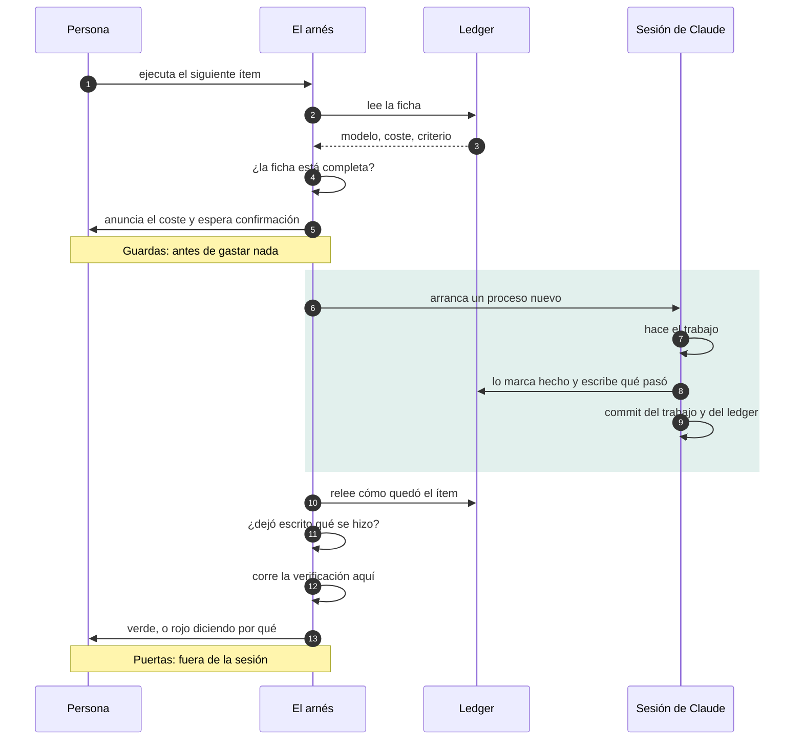
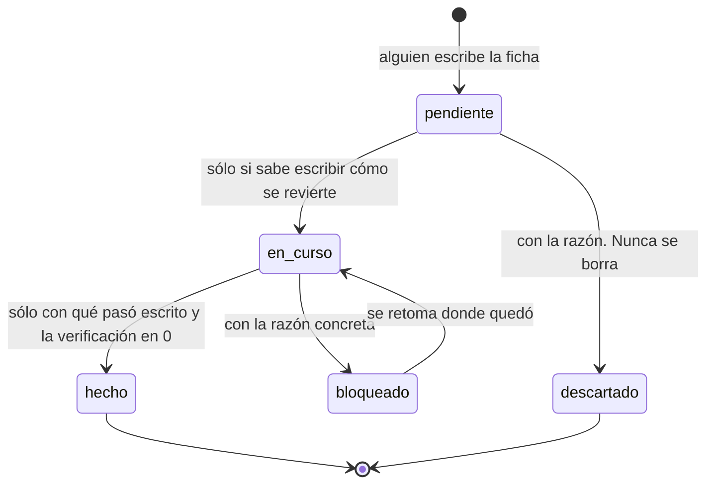

# Arnés de ejecución de planes de ingeniería

Una forma de trabajar con un asistente de código en tareas largas sin que se pierda el hilo,
sin que se dispare el coste y sin que nadie tenga que acordarse de en qué iba.

Es un plugin de Claude Code. No depende del lenguaje ni del stack de tu proyecto: lo único que
deja en tu repositorio es el ledger, un JSON con tu plan. La herramienta se actualiza con
`claude plugin update`; tu plan no se toca.

---

## El problema que resuelve

Cuando le pides a un asistente que ejecute un plan de varias semanas, pasan cuatro cosas:

1. **Se pierde el avance.** La sesión se corta —límite de uso, un `/clear`, cerrar la terminal— y
   con ella se va el "por dónde íbamos". Lo que quedó a medias no está en ningún sitio.
2. **El coste se descontrola.** Todo se hace con el modelo más caro porque nadie decidió por
   adelantado cuál merecía cada tarea, y el contexto de la sesión crece arrastrando lo anterior.
3. **El alcance se desborda.** Empieza arreglando una cosa, encuentra otra, y tres horas después
   hay un diff de 40 archivos que nadie puede revisar.
4. **"Ya está" no significa nada.** Sin un criterio escrito ANTES, el criterio se escribe después,
   viendo el resultado — que es la forma estándar de conseguir el número que uno quería.

El arnés ataca las cuatro con la misma idea: **el plan vive en un archivo del repositorio, no en la
memoria de una conversación**, y se ejecuta un ítem por sesión.

---

## Cómo funciona

Dos dibujos y se entiende entero. GitHub los renderiza aquí mismo; la misma fuente alimenta la
página de presentación (`docs/como-funciona.html`), y `tests/prueba.sh` falla si las dos copias
dejan de coincidir.

**Una invocación, de principio a fin.** Lo único que hay que mirar es la caja: dentro está lo que
el agente dice de su propio trabajo, y fuera está lo que decide si el ítem cuenta como cerrado.



**El ciclo de vida de un ítem.** Las condiciones están escritas en las flechas porque el arnés las
comprueba él: no son buenas intenciones. Y ningún camino borra nada.



---

## Las piezas

| Pieza | Qué hace |
|---|---|
| `docs/plan/ejecucion-plan.estado.json` | **El ledger.** La fuente de verdad del avance. Sobrevive al reinicio del límite, a `/clear` y a cerrar la terminal. Todo lo demás lo lee. |
| `/plan-siguiente` | Ejecuta **un** ítem, lo verifica con su propio criterio, actualiza el ledger, commitea y **se detiene**. Acepta un id o `ola:N`. |
| `/plan-estado` | El avance sin ejecutar nada. Corre en el modelo barato; cuesta casi nada. |
| `scripts/plan-run.sh` | Lanza un ítem en una **sesión nueva** de Claude Code: contexto limpio de verdad, no un `/clear`. Anuncia el ítem antes y frena si algo no cuadra. |
| Hook `SessionStart` | Cada sesión arranca sabiendo qué ítem toca. Lo resuelve un script, así que averiguarlo cuesta cero tokens. |
| `scripts/validar-ledger.py` | Comprueba que el ledger está bien formado. Un campo mal escrito no rompe nada visiblemente: sólo hace que la próxima invocación elija mal. Con `--item ID` juzga una sola ficha, que es como lo llama `plan-run.sh` antes de gastar. |

---

## Instalar

```bash
claude plugin marketplace add DanielWueno/arnes-plan
claude plugin install arnes-plan@arnes-plan
```

Reinicia la sesión para que carguen el hook y los dos comandos. A partir de ahí, en cualquier
proyecto:

```bash
/plan-estado        # el avance, sin ejecutar nada
/plan-siguiente     # ejecuta UN ítem y se detiene
```

Dentro de una sesión de Claude Code no hace falta nada más: esos dos comandos ya saben dónde está
el plugin. Lo de abajo es para la terminal, y existe porque un slash command no puede darte lo que
más valor tiene aquí — que cada ítem arranque en un proceso nuevo, sin heredar el contexto de lo
anterior.

### Dejar el proyecto listo

Recién instalado el plugin, dentro de Claude Code:

```
/plan-arrancar
```

Sin rutas y sin variables: dentro de una sesión el plugin ya sabe dónde está. Sirve tanto si eres
el primero que llega como si el plan ya existe, y además instala el lanzador `arnes` para la
terminal. Desde fuera de Claude Code es `bash "$ARNES/arrancar.sh"`, con el mismo efecto.

- **Repositorio sin plan:** siembra la plantilla y te dice qué escribir.
- **Repositorio que ya tiene plan** —el caso del segundo que clona— **no toca nada**, valida el
  ledger que hay y te anuncia el ítem que toca. Correrlo dos veces no hace daño.

Nunca sobrescribe un ledger. Merece la pena decir por qué existe este script en vez de un `cp` en
las instrucciones: el arranque documentado antes era copiar la plantilla encima de
`ejecucion-plan.estado.json`, y eso es una bomba. El segundo miembro del equipo clona, sigue el
README al pie de la letra, y le pasa por encima al plan del primero —sin preguntar, sobre un JSON
versionado que a esas alturas es la única fuente de verdad del avance. Un README que avisa "ojo, si
ya existe no lo copies" es exactamente la clase de regla que este proyecto lleva moviendo al código
desde el principio: la que sólo se cumple si alguien se acuerda.

### El comando `arnes`

`/plan-arrancar` instala un lanzador en `~/.local/bin` —donde vive el propio `claude`, así que ya
está en tu PATH— y a partir de ahí el arnés es un comando normal:

```bash
arnes                    # el siguiente ítem, en sesión limpia
arnes --solo-anunciar    # qué toca, sin ejecutar ni gastar
arnes 5.0 --auto         # uno concreto, con menos prompts
arnes arrancar           # dejar listo otro proyecto
```

**No lleva ninguna ruta dentro.** Resuelve la instalación en cada ejecución, así que sigue
funcionando después de cada `claude plugin update` sin que haya que tocarlo ni recordar nada. Si lo
borras, `/plan-arrancar` lo vuelve a crear; si ya tenías un `arnes` tuyo en el PATH, no lo pisa.

Y resuelve a la instalación **activa**, no a la versión más alta que haya en el cache: ahí quedan
las viejas y también versiones que nunca se activaron, y ejecutar en silencio una que no está en
uso es justo el fallo que este arnés existe para no cometer.

<details>
<summary>Si prefieres no instalar nada en el PATH</summary>

Las rutas largas siguen funcionando. `ARNES` es el directorio `scripts/` del plugin:

```bash
export ARNES="$(claude plugin list --json \
  | python3 -c 'import json,sys; print(next(p["installPath"] for p in json.load(sys.stdin) if p["id"].startswith("arnes-plan")))')/scripts"
```

Ojo con dos cosas que confunden: `claude plugin list` a secas **no** dice la ruta —sólo nombre,
versión y estado, hace falta `--json`— y para actualizar el nombre tiene que ir cualificado,
`claude plugin update arnes-plan@arnes-plan`.
</details>

### Ejecutar

```bash
bash "$ARNES/plan-run.sh" --solo-anunciar   # ¿qué toca? (no ejecuta nada)
bash "$ARNES/plan-run.sh"                   # ejecutar el siguiente, en sesión limpia
bash "$ARNES/plan-run.sh" 5.0               # ejecutar uno concreto
bash "$ARNES/plan-run.sh" ola:5             # el siguiente de una ola
```

Las banderas van en cualquier orden y se combinan con el id.

### Cuánta supervisión

| Modo | Qué cambia | Cuándo |
|---|---|---|
| *(por defecto)* | Sesión interactiva. Apruebas los permisos y las confirmaciones. | Casi siempre. Es el que no te sorprende. |
| `--auto` | Interactiva, pero el clasificador de auto mode resuelve los permisos rutinarios. Lo destructivo sigue frenando y tú sigues delante para confirmar una corrida larga. | Ítems con mucho toqueteo de archivos donde aprobar uno por uno sólo cansa. La primera vez, Claude Code pide aceptar el modo. |
| `--desatendido[=N]` | Sin sesión interactiva (`claude -p`), con techo de gasto en dólares (`N`, por defecto 5). | Los ítems mecánicos: `haiku`, cero horas de máquina. Revisas el commit al terminar, no durante. |

`--desatendido` **se niega** —y dice por qué— si el ítem pide más de una hora de máquina, lleva
`multiagente`, **el ledger lo marca `opus`**, está bloqueado, o el árbol tiene cambios sin
commitear. No es celo: en modo `-p` no hay a quién preguntar, y el protocolo exige preguntar justo
en esos casos. Una pregunta que nadie puede responder no es una puerta, es un cuelgue. `--igual`
salta las guardas bajo tu responsabilidad.

Lo de `opus` merece una línea aparte, porque es la guarda que más se nota: ese campo es justo con
el que el ledger declara *"aquí el CRITERIO es el trabajo"*. Dejar sin nadie delante precisamente
eso es dejar solo lo único que el arnés dice que no hay que dejar solo. La regla estaba escrita en
este README y no en el código, que es exactamente cómo una regla deja de cumplirse.

### La ficha tiene que estar completa antes de gastar

Antes de cualquier puerta de gasto y antes de arrancar la sesión, `plan-run.sh` valida **la ficha
del ítem que va a ejecutar**. Si le falta un campo obligatorio, no lanza nada: exit 1 y el
validador dice cuál. Esto ocurre en *todos* los modos, no sólo en `--desatendido`.

`rollback` es obligatorio en los ítems `pendiente` y `en_curso`, y no en los ya cerrados. Es la
regla que la plantilla ya enunciaba —*si no sabes escribir cómo se revierte, el ítem no está listo
para ejecutarse*— y no se puede aplicar hacia atrás: los ítems cerrados antes de que el campo
existiera no se van a volver a tocar, y reclamárselo sería ruido permanente. Un `"rollback": ""`
cuenta como ausente: un campo en blanco no es un plan de reversión.

Los slash commands ya validaban el ledger, pero **al cerrar**. Eso descubre el campo que falta
después de haber pagado la sesión; esta guarda lo descubre antes. `--igual` la salta, como las
demás.

Regla práctica: **si el ledger dice `haiku` y 0 horas, `--desatendido` es seguro; si dice `opus`,
quédate delante.** El campo `modelo` ya codifica cuánto criterio hace falta, y desde la 1.1.0 el
arnés la aplica él en vez de confiar en que te acuerdes.

### Y tiene que demostrarlo antes de darse por cerrado

Un ítem vuelve marcado `hecho` porque **lo marcó el mismo agente que lo hizo**. Por sí solo eso es
autoevaluación, y es el punto por donde se cuela un `hecho` optimista. Al salir la sesión —en todos
los modos— `plan-run.sh` comprueba dos cosas que no dependen de su palabra:

| Puerta | Qué exige | Por qué no basta con lo de antes |
|---|---|---|
| **Rastro** | El ítem cerrado trae `resultado`: qué se hizo y qué evidencia lo prueba. | Es el único rastro del cierre que otro puede leer y comprobar. Un `hecho` sin `resultado` es un `hecho` optimista con otro nombre. |
| **Criterio mecánico** | Si la ficha trae `verificacion_comando`, se corre **aquí**, y tiene que salir 0. | Corrido fuera de la sesión que declaró el ítem hecho, es la diferencia entre *"el agente dice que pasa"* y *pasa*. |

El comando corre en la raíz del proyecto, con un límite de tiempo (`ARNES_LIMITE_VERIFICACION`, por
defecto 900 s) para que un comando colgado no deje una sesión desatendida esperando para siempre.

Si alguna puerta falla, el script sale distinto de 0 y enseña las últimas líneas del comando. **No
revierte nada**: el commit ya existe, y deshacerlo es una decisión tuya con el `rollback` de la
ficha delante. Reabrir el ítem es cambiarle el estado a `en_curso`. `--igual` salta las dos puertas.

`resultado` se reclama **en el momento de cerrar**, no en el barrido general del validador — igual
que `rollback` sólo se le pide a lo que aún se va a ejecutar. Los ítems que se cerraron antes de
que la regla existiera no se van a volver a tocar, y reclamárselos sería ruido permanente. Lo que
cambia es cuándo se comprueba, no qué.

Dentro de una sesión de Claude Code ya abierta, lo mismo se pide con `/plan-estado` y
`/plan-siguiente`. La diferencia es el contexto: `plan-run.sh` arranca un proceso nuevo, así que el
ítem no hereda nada de lo que estuvieras haciendo antes.

**Cadencia recomendada:** `--solo-anunciar` para ver qué viene, ejecutar, revisar el commit, decidir
si sigues. Nada avanza sin que lo pidas.

---

## Tu primer ledger

El ledger es tuyo y vive en tu repositorio; el plugin no se lleva nada a otro sitio. Lo siembra
`bash "$ARNES/arrancar.sh"` —que **no sobrescribe** si ya hay uno— y a partir de ahí escribir los
ítems es cosa tuya: es lo único que no se puede automatizar.

```bash
/plan-arrancar                          # o: arnes arrancar
arnes arrancar --donde docs/analisis-futuro   # otra carpeta
python3 "$ARNES/validar-ledger.py"      # cuando hayas escrito tus ítems
```

No hace falta que el otro proyecto sea .NET, ni que use las mismas carpetas: el ledger se busca en
`docs/plan/`, `docs/analisis-futuro/` y `.claude/plan/`, y la variable `PLAN_LEDGER` manda sobre
todas si lo tienes en otro sitio.

El campo `_moneda` de la plantilla es tuyo: aquí `horas_maquina` mide tiempo de ingesta y
evaluación, pero en tu proyecto será otra cosa. Cámbialo y dilo en ese campo — es el recurso
escaso el que decide qué ítems se lanzan sin preguntar.

---

## El ledger

```json
{
  "olas": [
    {
      "ola": 1,
      "nombre": "Red de seguridad y reproducibilidad",
      "criterio_de_entrada": "Ninguno. Es la primera.",
      "criterio_de_salida": "Una frase falsable. Si no se comprueba con un comando, no es criterio.",
      "advertencia_de_coste": "Opcional. Si la ola cuesta caro, dilo aquí: se repite antes de ejecutar.",
      "items": [ ... ]
    }
  ]
}
```

Cada ítem lleva estos campos, y todos son obligatorios:

| Campo | Para qué |
|---|---|
| `id` | `<ola>.<letra o número>-<slug>`. Es lo que se escribe en `plan-run.sh 5.0`. |
| `titulo` | **Qué pasa hoy**, no qué hacer. "Los logs viven dentro de `src/` y pesan 46 MB" se verifica; "mejorar el logging" no. |
| `verificacion` | El comando exacto que decide si está hecho, y qué salida cuenta como verde. Es el campo que más se descuida y el que más importa. |
| `modelo` | `haiku` \| `sonnet` \| `opus`. Ver abajo. |
| `esfuerzo` | `low` \| `medium` \| `high`. |
| `horas_maquina` | Tiempo de reloj, **no** tokens. Por encima de 1 el arnés pide confirmación. |
| `multiagente` | `true` sólo donde un error sería silencioso y caro de detectar. |
| `estado` | `pendiente` \| `en_curso` \| `hecho` \| `bloqueado` \| `descartado`. |
| `por_que_este_modelo` | Una línea. Obliga a justificar el gasto en vez de elegir por inercia. |

Opcionales que valen su peso: `archivos` (qué toca — evita que el ítem se desborde), `rollback`
(cómo se revierte; si no lo sabes escribir, el ítem no está listo), `bloquea` / `bloqueado_por`,
y `origen` (por qué existe este ítem).

Y dos que sostienen las puertas de cierre:

| Campo | Para qué |
|---|---|
| `verificacion_comando` | La parte de `verificacion` que una máquina puede decidir sola, como una línea de shell que sale 0 o no. **El arnés la corre él**, en la raíz del proyecto, después de la sesión. Si tu criterio no cabe en un comando —"clasificar 30 casos a mano"— deja el campo fuera: media verificación automática mentiría más de lo que ayuda. |
| `resultado` | Qué pasó, al cerrarlo. Obligatorio en un ítem que pasa a `hecho`. No es el estado, es la evidencia. |

`verificacion_comando` se ejecuta con tu shell y tus permisos, igual que un `Makefile` del
repositorio. Vale lo mismo que el ledger: si no te fiarías de correr a ciegas lo que dice, no te
fíes del ledger tampoco.

### Cómo se elige el modelo

- **haiku** — lo verifica un `find`, el compilador o un hash. Pagar más aquí es tirar dinero.
- **sonnet** — el resto.
- **opus** — donde el CRITERIO es el trabajo: diseñar el oráculo de un test, decidir una
  descomposición, verificar un hallazgo dudoso. Un test que afirma el bug actual es peor que no
  tener test, y evitar eso es criterio, no ejecución.

### Las olas

No son sprints ni fases: son **dependencias**. La 1 construye la verificación de la que dependen
las demás, así que no se empieza la 2 con ítems de la 1 abiertos. Cada una declara qué tiene que
ser cierto para entrar y para salir.

---

## Las reglas que hacen que esto funcione

Están escritas dentro de los comandos, no dependen de que nadie se acuerde:

1. **Un ítem por invocación, y luego DETENERSE.** Nada de "ya que estoy aquí". Es lo que mantiene
   los diffs revisables.
2. **Commit al cerrar cada ítem.** Lo máximo que se puede perder si el límite corta la sesión es el
   ítem en curso.
3. **El criterio de éxito se declara antes de ejecutar**, dentro del ledger. Y en unidades que
   existan: con 40 preguntas etiquetadas, "+5 puntos porcentuales" no es una medida — "gana 4
   preguntas y no pierde ninguna" sí.
4. **Aviso de coste antes de gastar.** Por encima de 1 hora de máquina se pregunta.
5. **El alcance no se expande.** Si aparece otro problema, se anota como ítem nuevo al final de su
   ola y se sigue con el que estaba.
6. **Nada de multiagente por defecto.** Cuando ya hay verificación mecánica, un panel de agentes
   votando sobre un diff es peor y mucho más caro que correr los tests.
7. **Escepticismo con n=1**, y probar el escenario de riesgo real, no sólo el benigno.
8. **Un ítem que se descarta no se borra**: pasa a `descartado` con su razón. Es lo que evita que
   vuelva a proponerse desde cero dentro de tres meses.

---

## Para quien llega nuevo al equipo

Lo mínimo que necesitas saber, en orden:

1. **`bash "$ARNES/plan-run.sh" --solo-anunciar`.** Te dice qué toca. No ejecuta nada, no gasta
   nada. Empieza por ahí.
2. **El ledger es el plan.** Si quieres saber por qué algo está como está, búscalo por su `id`: los
   ítems cerrados llevan un campo `resultado` con qué se hizo y qué evidencia lo prueba.
3. **No ejecutes un ítem "a mano" y lo des por hecho.** El valor está en que la verificación se
   corrió de verdad y quedó registrada. Un `hecho` optimista contamina todo lo que venga después.
4. **Si te encuentras otro problema mientras trabajas, no lo arregles de paso.** Añádelo como ítem
   `pendiente` al final de su ola, con su verificación. Cuesta dos minutos y ordena el trabajo.
5. **Si algo del arnés te confunde, es un fallo del arnés.** Está pensado para que la primera vez
   sea leer esta página y correr un comando.

---

## Preguntas que salen siempre

**¿Por qué una sesión nueva por ítem y no un `/clear`?**
`/clear` vacía la conversación pero reutiliza la sesión. Cada invocación de `claude` es un proceso
nuevo: contexto limpio de verdad, con su propio id recuperable desde `/resume`, y con el modelo y
el esfuerzo que dice el ledger en vez de los que arrastrara la sesión anterior.

**¿El hook gasta tokens en cada arranque?**
Averiguar qué ítem toca lo resuelve un script de Python, no el modelo: eso es gratis. Lo que sí
ocupa contexto son las dos líneas que inyecta, y por eso son dos y no veinte. Si el ledger no
existe o no se puede leer, el hook no imprime nada.

**¿Y si mi proyecto no tiene "horas de máquina"?**
Cambia la unidad por la que sea escasa —minutos de CI, cuota de una API, tiempo de un despliegue— y
dilo en el campo `_moneda` del ledger. Lo que importa es que exista un número que dispare la
confirmación antes de gastar.

**¿Puedo ejecutar los ítems sin supervisión?**
Los mecánicos sí: añade `-p --permission-mode acceptEdits --max-budget-usd N` a la llamada de
`claude` dentro de `plan-run.sh`. `--max-budget-usd` da un techo duro de gasto y sólo funciona con
`-p`. Los ítems que piden confirmación (más de una hora de máquina) deben seguir siendo
interactivos: en modo `-p` no hay a quién preguntar.

**¿Esto sirve si no uso Claude Code?**
El ledger, el validador y la disciplina sí — son un JSON y unas reglas. Los comandos y el hook son
específicos de Claude Code.

---

## Ficheros

```
.claude-plugin/
  plugin.json                manifiesto y versión (semver)
  marketplace.json           hace el repo instalable con `marketplace add`
commands/
  plan-siguiente.md          /plan-siguiente
  plan-estado.md             /plan-estado
  plan-arrancar.md           /plan-arrancar — puesta en marcha sin rutas
hooks/hooks.json             el hook SessionStart
scripts/
  arrancar.sh                deja el proyecto listo e instala el lanzador `arnes`
  plan-run.sh                lanza un ítem en sesión limpia
  plan-siguiente-linea.py    el hook SessionStart
  ledger_path.py             localiza el ledger (PLAN_LEDGER manda)
  validar-ledger.py          valida el ledger (o una ficha, con --item); sale 1 y dice qué falta
  validar-diagramas.py       comprueba que el README y la página cuentan el mismo diagrama
plantillas/
  ledger.plantilla.json      semilla para un proyecto nuevo
docs/
  como-funciona.html         la página de presentación; el Mermaid sale del README
tests/prueba.sh              la regresión completa
```

En tu proyecto no queda nada de esto: sólo el ledger, donde tú lo pongas.
